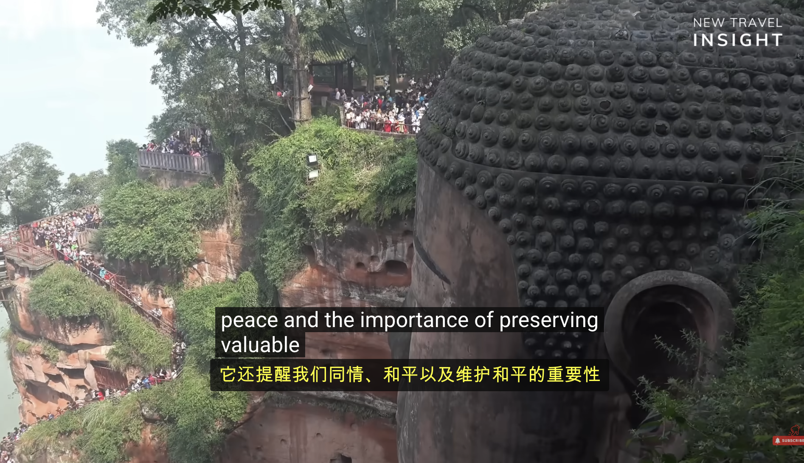

# YouTube 实时字幕翻译器

> Opus 4.6 vibecoding 项目 - YouTube 英文字幕实时翻译成中文的浏览器扩展



## ✨ 功能特性

- 🌐 **实时翻译** - 自动检测并翻译 YouTube 字幕，几乎零延迟
- 🎯 **双语字幕** - 同时显示原文和翻译字幕，方便对照学习
- 💾 **智能缓存** - 缓存翻译结果，避免重复翻译
- 🎨 **原生样式** - 完美融入 YouTube 界面，无违和感
- 🌍 **多语言支持** - 支持翻译到中文、日文、韩文等 8+ 种语言

## 📦 安装方法

### Chrome / Edge 浏览器

1. 下载或克隆本仓库
2. 打开浏览器，访问 `chrome://extensions/`
3. 右上角开启 **"开发者模式"**
4. 点击 **"加载已解压的扩展程序"**
5. 选择本扩展文件夹
6. 完成！扩展图标会出现在工具栏

### Firefox 浏览器

1. 下载或克隆本仓库
2. 打开浏览器，访问 `about:debugging#/runtime/this-firefox`
3. 点击 **"临时载入附加组件"**
4. 选择扩展文件夹中的 `manifest.json` 文件
5. 完成！

## 🎮 使用方法

1. **打开 YouTube 视频**
   - 确保视频有字幕（自动生成或手动上传）
   - 点击 CC 按钮开启字幕

2. **查看翻译**
   - 翻译后的字幕会自动显示在原文字幕上方
   - 原文和译文同时显示，方便对照

3. **调整设置**
   - 点击浏览器工具栏的扩展图标
   - 可开关翻译功能
   - 可选择目标语言（默认：简体中文）

## ⚙️ 支持的语言

- 🇨🇳 简体中文
- 🇹🇼 繁体中文
- 🇺🇸 英文
- 🇯🇵 日文
- 🇰🇷 韩文
- 🇪🇸 西班牙文
- 🇫🇷 法文
- 🇩🇪 德文

## 🔧 技术实现

- **翻译引擎**: Google Translate API（免费）
- **字幕检测**: MutationObserver 实时监听 DOM 变化
- **缓存机制**: JavaScript Map 缓存翻译结果
- **样式适配**: 完美适配 YouTube 原生字幕样式

## 📝 文件结构

```
youtube-chinese-subtitle/
├── manifest.json       # 扩展配置文件
├── content.js          # 核心翻译逻辑
├── styles.css          # 字幕样式
├── popup.html          # 设置界面
├── popup.js            # 设置逻辑
├── background.js       # 后台服务
├── icons/              # 扩展图标
│   ├── icon16.png
│   ├── icon48.png
│   └── icon128.png
├── screenshot.png      # 效果截图
└── README.md           # 说明文档
```

## 🚀 进阶使用

### 替换为更高质量的翻译 API

在 `content.js` 中替换翻译引擎：

**DeepL API**（翻译质量更高）:
```javascript
const url = 'https://api-free.deepl.com/v2/translate';
// 参考 DeepL 文档实现
```

**OpenAI API**（上下文感知）:
```javascript
const url = 'https://api.openai.com/v1/chat/completions';
// 参考 OpenAI 文档实现
```

### 本地翻译模型（离线使用）

使用 Transformers.js 在浏览器中运行本地模型：
```javascript
import { pipeline } from '@xenova/transformers';
const translator = await pipeline('translation', 'Xenova/nllb-200-distilled-600M');
```

## ⚠️ 注意事项

1. **必须有字幕**
   - 视频必须有字幕（自动生成或上传）
   - 无字幕时扩展无法工作

2. **网络要求**
   - 需要能访问 Google Translate API
   - 部分地区可能需要代理

3. **性能影响**
   - 翻译会消耗少量网络和 CPU 资源
   - 缓存机制可减少重复翻译

## 🐛 常见问题

### 翻译不显示
1. 检查视频是否有字幕
2. 确认字幕已开启（CC 按钮）
3. 刷新页面重试
4. 检查浏览器控制台错误

### 翻译延迟
1. 检查网络连接
2. 清除浏览器缓存
3. 考虑使用更快的翻译 API

### 样式问题
1. YouTube 可能更新了界面
2. 可能需要更新 CSS 选择器
3. 欢迎提交 Issue 反馈

## 📄 开源协议

MIT License

## 🤝 贡献

欢迎提交 Issue 和 Pull Request！

## 📧 联系方式

有问题或建议请在 GitHub 上提 Issue。

---

**祝你无障碍享受 YouTube！** 🎉
